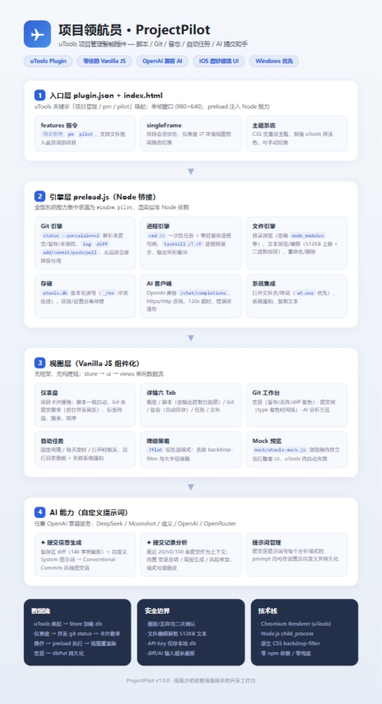

# 项目领航员 ProjectPilot

一个面向开发者的**轻量级项目管理智能领航台**（uTools 插件形态）：一键启动脚本与服务、Git 变更与提交历史、项目备忘、自动任务、**系统内存 / CPU / 端口监听**、**领航建议（任务推荐）**，并集成 **AI 生成提交信息** 与 **提交记录分析**（模式与提示词均可自定义）。前端 Vue 3 + Vite，iOS 磨砂玻璃质感，浅色/深色主题。



## ✨ 功能

### 🛰 领航建议（任务推荐）
- 规则引擎实时扫描项目态势，自动生成可执行建议：未提交变更过多、落后/领先远程、服务运行中（附监听端口）、自动任务失败、长期未动的项目…
- 每条建议一键「去处理」直达对应 Git / 任务页
- **✦ AI 今日建议**：把全部项目态势 + 系统端口发给模型，生成当日规划建议（可选，需配置 AI）

### 🖥 系统状态（轻量 Agent 能力）
- 顶栏实时显示**内存占用**（进度条 + 已用/总量，3s 刷新）与 **CPU 占用**（采样）
- **端口监听**：15s 扫描本机 TCP LISTENING 端口（netstat + tasklist 进程名映射），HTTP 开发端口一键在浏览器打开
- 项目关联：运行中的服务脚本自动匹配 `:3000` `:5173` 等开发端口

### 🚀 项目仪表盘
- **三视图**：卡片 / 紧凑 / 列表三种密度一键切换，偏好持久化
- 项目卡片：图标、标签、路径、最近使用时间，**Git 未提交徽章**（分支、未提交数、领先/落后，后台并发刷新）
- 脚本一键运行，服务型进程显示运行状态、可直接停止
- 排序：最近使用 / 最近更新（按最后提交时间）/ 变更最多 / 按标签 / 名称；按 `/` 快速聚焦搜索
- 标签筛选 / 搜索；添加项目支持文件夹选择、手动路径、**拖拽文件夹进窗口**、uTools 文件入参

### 🧭 工作台（建议 + 待办）
- **领航建议**与**全局待办**合并在一个子页签面板，紧急建议会自动展开提醒
- 待办支持列表 / 四象限（紧急·重要）两种视图，可关联项目

### 🔧 脚本 & 服务
- 常用命令保存为一键脚本；服务型脚本（dev server 等）常驻运行、可启停
- 底部**控制台抽屉**实时查看进程输出，支持复制/清屏

### ⑂ Git 工作台
- **变更**：已暂存 / 未暂存 / 未跟踪 / 冲突分组，单文件暂存、取消、丢弃；着色 diff
- **提交**：一键 commit；暂存区有内容时 **✦ AI 生成**提交信息
- **提交历史**：时间线（type 着色、短哈希、作者、相对时间）+ 提交详情与变更文件
- **分支管理**：切换 / 新建（可指定基于分支）/ 删除，当前分支可点击直达
- **stash**：一键存入 / 恢复最新 / 列表管理，切分支救急
- **跨项目聚合总览**：工具栏一键查看所有项目的未提交变更，直达对应项目去提交
- 拉取 / 推送 / 全部暂存快捷操作

### 🤖 AI 能力（任意 OpenAI 兼容服务）
- **AI 今日建议**：项目态势 + 待办 + 最近提交 + 失败任务汇总给模型，结构化输出可点击的当日规划（按天持久化，一天一份）
- AI 提交信息：暂存区 diff（自动截断）+ 自定义提示词 → Conventional Commits 风格
- AI 提交分析：内置「变更总结 / 周报生成 / 风险审查」，支持**自定义模式与提示词**，可选分析最近 20/50/100 条
- 设置页配置 Base URL / API Key / 模型 + 连通性测试（DeepSeek、Moonshot、通义、OpenAI、OpenRouter…）

### 💾 数据备份
- **一键导出**：项目 / 设置 / 待办 / 通知 / AI 建议导出为 JSON 文件
- **导入恢复**：合并导入（路径去重，保留本地数据）或全量覆盖，换机迁移不丢数据

### 📝 备忘 / ⏱ 自动任务 / 🗂 文件
- 备忘：项目级便签，输入即存，导出 `NOTES.md`
- 自动任务：固定间隔 / 每天定时 / 打开插件时触发；运行日志留痕 + 失败系统通知
- 文件：轻量浏览（隐藏 node_modules 等噪声）、文本预览/编辑、重命名/删除/新建

### 🎨 设计与工程
- iOS 磨砂玻璃（backdrop-filter + 柔光斑），浅/深/跟随系统主题；lucide 矢量图标体系
- **前端 Vue 3 + Vite**：reactive store 单向数据流，组件化视图，`npm run build` 产物即插件
- **Vitest 单测**（`npm test`）：建议规则引擎 / 状态与持久化 / mock 契约防漂移 / 备份导入导出
- GitHub Actions CI：push/PR 自动跑测试 + 构建 + 产物检查
- `?flat` 低性能降级（去重度模糊）；`mock/utools-mock.js` 让整套 UI 在浏览器独立运行（uTools 内自动失效）

## 📦 安装 & 开发

```bash
npm install
npm run build      # 产物输出到 dist/
# uTools → 设置 → 开发者 → 新建插件项目，指向本目录（plugin.json 已指向 dist/index.html）
npm run watch      # 开发时增量构建
npm run dev        # 纯前端开发（mock 模式，浏览器直接调试）
```

## 🗂 目录结构

```
utools-project-pilot/
├── plugin.json            # uTools 插件清单（main → dist/index.html）
├── preload.js             # Node 引擎：Git / 进程 / 文件 / DB / AI / 系统监测
├── index.html             # Vite 入口
├── src/
│   ├── main.js            # 挂载 + 全局错误钩子
│   ├── store.js           # reactive 状态：项目/设置/Git 缓存/进程/自动任务/系统轮询
│   ├── ui.js              # toast / modal / confirm / 工具
│   ├── advisor.js         # 领航建议：规则引擎 + AI 增强
│   ├── assets/app.css     # iOS 磨砂玻璃样式（双主题）
│   ├── components/        # Dashboard / ProjectCard / SysBar / Suggestions /
│   │                      # Detail / Tab×6 / GitChanges / GitHistory / GitInsights /
│   │                      # ConsoleDrawer / ToastHost / ModalHost
│   └── modals/            # 添加项目 / 编辑项目 / 脚本 / 任务 / 任务日志 / 分析模式 / 设置 / 端口
├── public/mock/           # 浏览器预览 mock（uTools 内自动失效）
├── assets/tech-stack.png  # 技术栈全景图
└── scripts/gen-logo.js    # logo 生成脚本
```

## 🔒 安全说明

- 删除 / 丢弃变更等危险操作均二次确认；文件编辑限 512KB 文本
- API Key 仅存本地 uTools 数据库；发送给 AI 的 diff / 日志超长自动截断
- 端口扫描为只读 netstat，不上传任何数据

## License

MIT
